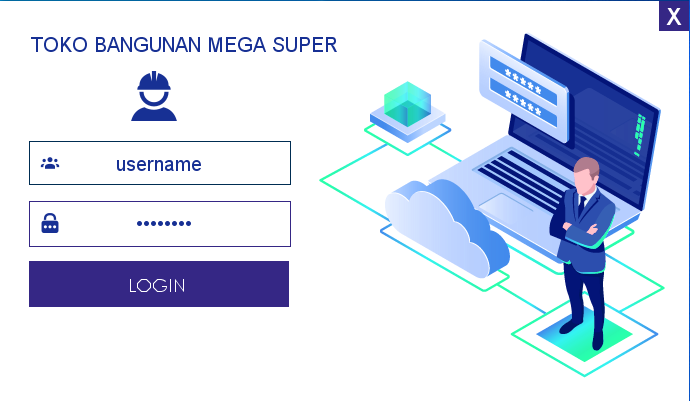
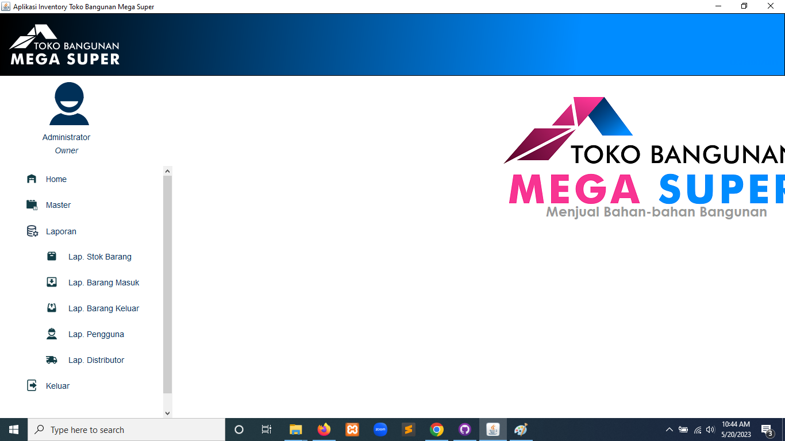

# Inventory_Team_8

SISTEM INFORMASI INVENTORY TOKO BANGUNAN BERBASIS JAVA

ANNGOTA KELOMPOK :
1. Ekky Abi Pratama
2. Lukman Asfrika
3. Intan Rachmawati Sinaga
4. Isa Maulana Danang A
5. Irwandi
6. Fajri

# FITUR :

A. MASTER
   1. BARANG
   2. KATEGORI
   3. DISTRIBUTOR
   4. PENGGUNA
   5. BARANG MASUK
   6. BARANG KELUAR

B. LAPORAN
   1. LAP. STOK BARANG
   2. LAP. BARANG MASUK
   3. LAP. BARANG KELUAR
   4. LAP. PENGGUNA
   5. LAP. DISTRIBUTOR

## Contoh Tampilan 

* Login Aplikasi

* Menu Utama

* Sub Menu Data Master

* Sub Menu Laporan

Change log Issue:
- Menu Laporan Pengguna blm rampung, msh dlm proses
- Menu Laporan Distribur blm rampung, msh dlm proses

# TO DO :
- Retur Barang
- Stokopname Barang
- Laporan Retur Barang
- Laporan Stokopname Barang

